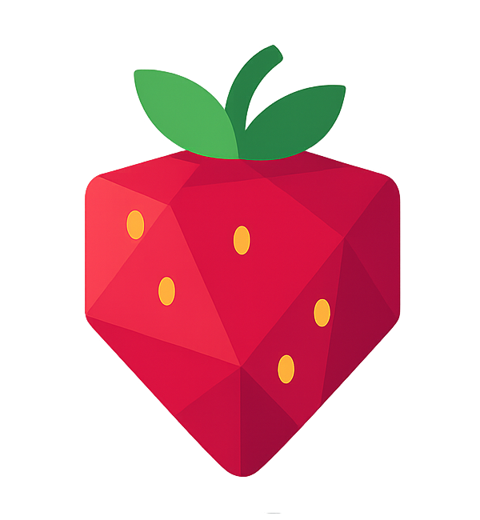

<div align="center">
  
  <h1>Strawberry Jam</h1>
  <a href='https://discord.gg/HzFe7XpuPs'>
    
  </a>
</div>

<br />

<div align="center">
A tool for exploring and extending <a href="https://classic.animaljam.com">Animal Jam Classic</a>!
<br /><br />
<em>Strawberry Jam is a fork of the original <a href="https://github.com/Sxip/jam">Jam</a> project by sxip.</em>
</div>

## 🚀 Quick Start

### 🪟 Windows
1.  Download `Strawberry-Jam-Setup.exe` from our [latest release](https://github.com/glvckoma/strawberry-jam/releases/latest)
2.  Run the installer
3.  Launch Strawberry Jam from your Start menu

### 🍎 MacOS
1.  Download `Strawberry-Jam.dmg` from our [latest release](https://github.com/glvckoma/strawberry-jam/releases/latest)
2.  Open and drag to Applications
3.  Open Terminal and run: `sudo /Applications/Strawberry\ Jam.app/Contents/MacOS/Jam`
    *   You'll need to type your password (it stays hidden as you type)

## ✨ Features

*   **🔍 Network Analysis:** Watch messages between your game and AJ's servers
*   **🔌 Plugin System:** Add cool new features with plugins
*   **🖥️ Easy to Use:** Simple desktop app with everything you need

## ⚠️ Important Warning!

Using tools like Strawberry Jam might break the game's rules and result in account termination. Please be careful and use it responsibly. Neither I nor Sxip are responsible for any loss of accounts.

## 📚 Learning More

New to Strawberry Jam? Check out our guides:

*   [Understanding the Strawberry Jam Window](community-guide/understanding-ui.md)
*   [Introduction to Packet Viewing](community-guide/packet-viewing.md)
*   [Using and Developing Plugins](community-guide/plugins.md)

## 💡 Have an Idea?

Got a cool idea for Strawberry Jam? We'd love to hear it!

*   **📝 Create an Issue:**
    *   Visit our [Issues page](https://github.com/glvckoma/strawberry-jam/issues)
    *   Click "New Issue"
    *   Tell us:
        *   What your idea does
        *   Why it would be fun/useful
    *   Don't worry about making it perfect!

*   **💬 Message on Discord:**
    *   Rather chat? Message me (**_glockoma**) on Discord!
    *   I'm always happy to hear your ideas

## 👩‍💻 For Developers

Want to run from source or create plugins? Here's how to get started:

1.  Install [Node.js](https://nodejs.org)
2.  Clone the repo:
    ```bash
    git clone https://github.com/glvckoma/strawberry-jam.git
    cd strawberry-jam
    npm install
    npm run dev
    ```
